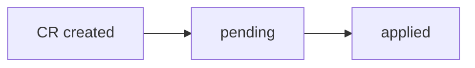

## Summary

Markdown files in the project (docs, CR bodies, bug bodies) can contain Mermaid diagram definitions inside fenced code blocks tagged as `mermaid`. Currently those blocks are displayed as syntax-highlighted source code — the diagram is never rendered. This CR introduces proper Mermaid diagram rendering so that flowcharts, sequence diagrams, entity-relationship diagrams and other chart types are visualised inline.

---

## Analysis

### Current behaviour

The `MarkdownRenderer` component (`code/frontend/src/components/MarkdownRenderer.tsx`) delegates all fenced code blocks to `react-syntax-highlighter` (Prism). Prism includes a Mermaid grammar, so the raw diagram source is colourised as text — but no diagram image is produced.

```

```

The above block renders as highlighted code, not as a flowchart.

### Proposed solution

Add the `mermaid` npm package to the frontend. In the `code` component handler inside `MarkdownRenderer`, intercept blocks whose `className` is `language-mermaid` and render them using a dedicated `MermaidBlock` component instead of passing them to `SyntaxHighlighter`.

`MermaidBlock` uses `mermaid.render()` to produce an SVG and injects it into the DOM. It must:

1. Call `mermaid.initialize()` once with theme settings that respect the app's light/dark mode.
2. Re-render the SVG whenever the diagram source or the resolved theme changes.
3. Display a plain `<pre>` fallback if Mermaid throws a parse error (invalid diagram syntax), without crashing the page.

### Theme integration

The app already exposes the resolved theme via `useTheme()` (returning `'light'` or `'dark'`). Mermaid supports a `theme` option (`'default'` for light, `'dark'` for dark) that must be kept in sync.

---

## Required changes

### New component — `MermaidBlock`

**File:** `code/frontend/src/components/MermaidBlock.tsx`

```typescript
import { useEffect, useRef, useState } from 'react';
import mermaid from 'mermaid';
import { useTheme } from '../context/ThemeContext';

interface MermaidBlockProps {
  chart: string;
}

export default function MermaidBlock({ chart }: MermaidBlockProps) {
  const { resolvedTheme } = useTheme();
  const containerRef = useRef<HTMLDivElement>(null);
  const [error, setError] = useState<string | null>(null);

  useEffect(() => {
    if (!containerRef.current) return;

    mermaid.initialize({
      startOnLoad: false,
      theme: resolvedTheme === 'dark' ? 'dark' : 'default',
    });

    const id = `mermaid-${Math.random().toString(36).slice(2)}`;

    mermaid.render(id, chart).then(({ svg }) => {
      if (containerRef.current) {
        containerRef.current.innerHTML = svg;
        setError(null);
      }
    }).catch((err) => {
      setError(String(err));
    });
  }, [chart, resolvedTheme]);

  if (error) {
    return <pre className="markdown-code-block text-red-500">{chart}</pre>;
  }

  return <div ref={containerRef} className="mermaid-diagram my-4" />;
}
```

### Updated `MarkdownRenderer`

**File:** `code/frontend/src/components/MarkdownRenderer.tsx`

Import `MermaidBlock` and add a guard in the `code` component handler before the existing `SyntaxHighlighter` call:

```typescript
import MermaidBlock from './MermaidBlock';

// Inside the `code` component:
code({ children, className, node: _node, ...props }) {
  const match = /language-([\w-]+)/.exec(className || '');
  const code = String(children).replace(/\n$/, '');

  if (match?.[1] === 'mermaid') {
    return <MermaidBlock chart={code} />;
  }

  if (match) {
    return (
      <div className="markdown-code-block" data-language={match[1]}>
        <SyntaxHighlighter ...>{code}</SyntaxHighlighter>
      </div>
    );
  }
  // ... rest unchanged
}
```

### Dependency

**File:** `code/frontend/package.json`

Add the `mermaid` package:

```bash
npm install mermaid
```

The `mermaid` package ships its own TypeScript types; no `@types/mermaid` package is needed.

---

## Acceptance criteria

- A `\`\`\`mermaid` block in a document, CR body, or bug body is rendered as an SVG diagram, not as source code.
- The diagram respects the app's current theme (light/dark).
- Switching theme re-renders the diagram with the appropriate Mermaid theme.
- An invalid Mermaid block (syntax error) shows the raw source as a `<pre>` fallback without crashing the page or throwing an unhandled exception.
- All existing non-mermaid code blocks continue to render with syntax highlighting as before.
- No backend changes are required.
